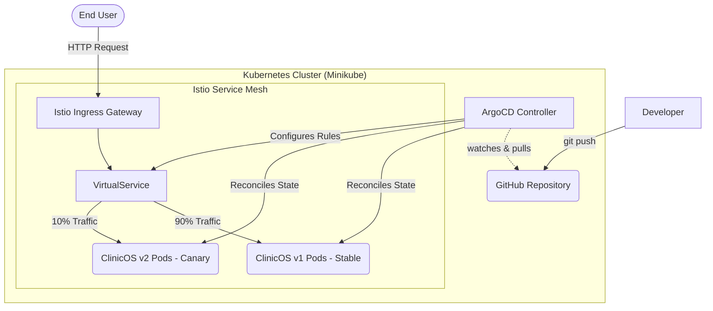

# 🚀 Enterprise GitOps & Service Mesh Platform

**Project:** Automated GitOps Release Platform with Istio Canary Routing  
**Domain:** Site Reliability Engineering (SRE), DevOps, Cloud-Native Architecture  
**Application:** ClinicOS (Stateless React Dashboard)  


## 📊 Executive Summary

This project demonstrates a production-grade Continuous Deployment (CD) pipeline utilizing **GitOps** principles and a **Service Mesh**. It solves the critical business problem of deployment downtime and the high risk associated with "big-bang" software releases. 

By integrating **ArgoCD** for declarative infrastructure synchronization and **Istio** for advanced network routing, this architecture allows new software versions to be safely tested in production on a fractional user base (10% Canary) before full promotion.


## 🏗️ System Architecture & Traffic Flow

The infrastructure operates on a strict pull-based GitOps methodology. The GitHub repository is the single source of truth for all application and infrastructure states.




## ⚙️ Technology Stack

| Domain | Technology | Implementation Details |
| --- | --- | --- |
| **Application** | React.js (Vite) | Stateless Single Page Application (ClinicOS). |
| **Containerization** | Docker | Multi-stage builds utilizing `nginx:alpine` for low-latency serving. |
| **Orchestration** | Kubernetes | Provisioned via Minikube (`6GB RAM`, `4 CPUs`). |
| **GitOps Controller** | ArgoCD | Automated, pull-based state reconciliation. |
| **Traffic Management** | Istio | Service mesh for telemetry, security, and weighted routing. |


## 📂 Repository Structure

```text
gitops-canary-pipeline/
├── .gitignore
├── Dockerfile                  # Multi-stage build instructions for ClinicOS
├── package.json                # Node.js application dependencies
├── README.md                   # Master documentation & Runbook
├── src/                        # ClinicOS React application source code
│   └── clinic-management-system.jsx
└── k8s/                        # Kubernetes Infrastructure as Code (IaC)
    ├── argocd/                 # Application sync manifests
    ├── app/                    # Deployments & Services for v1 and v2
    └── istio/                  # Gateway, VirtualService, and DestinationRules

```


## 🚀 Engineering Runbook (Execution Steps)

### Phase 1: Application Containerization (Completed)

* Developed `ClinicOS`, a dynamic medical dashboard.
* Engineered a highly optimized, multi-stage `Dockerfile`.
* Packaged two distinct release candidates:
* **v1 (Stable):** Primary teal user interface.
* **v2 (Canary):** Secondary purple user interface for A/B testing.


* Images pushed to Docker Hub global registry.

### Phase 2: Kubernetes & GitOps Initialization

1. **Provision Infrastructure:**
```bash
minikube start --memory=6144 --cpus=4

```


2. **Install ArgoCD:**
```bash
kubectl create namespace argocd
kubectl apply -n argocd -f [https://raw.githubusercontent.com/argoproj/argo-cd/stable/manifests/install.yaml](https://raw.githubusercontent.com/argoproj/argo-cd/stable/manifests/install.yaml)

```


### Phase 3: Service Mesh Injection

1. **Install Istio:**
```bash
istioctl install --set profile=default -y
kubectl label namespace default istio-injection=enabled

```


### Phase 4: Canary Deployment & Verification

1. **Apply GitOps Manifests:** Let ArgoCD sync the `k8s/` directory.
2. **Verify Traffic Split:** Access the Istio Ingress IP in a browser. Refreshing the application will yield the `v1` interface 90% of the time, and the `v2` (purple) interface 10% of the time, validating the zero-downtime routing protocol.


## 🛠️ Error Ledger & Troubleshooting

*A record of critical errors encountered during development and their engineered solutions.*

| Date | Error Code | Root Cause | Resolution |
| --- | --- | --- | --- |
| **[Current Date]** | `ENOENT: open '/app/package.json'` | Docker daemon could not locate `package.json` during the `RUN npm install` layer. | Relocated `Dockerfile` to the project root directory, ensuring it resides adjacent to `package.json`. Verified build context (`.`) was correctly passed. |
| **[Current Date]** | `vite: command not found` | Attempted to start local dev server without resolving project dependencies. | Executed `npm install` to hydrate the local `node_modules` directory before running the `dev` script. Added `node_modules/` to `.gitignore` to prevent repository bloat. |

*Architected and maintained to enterprise SRE standards.*