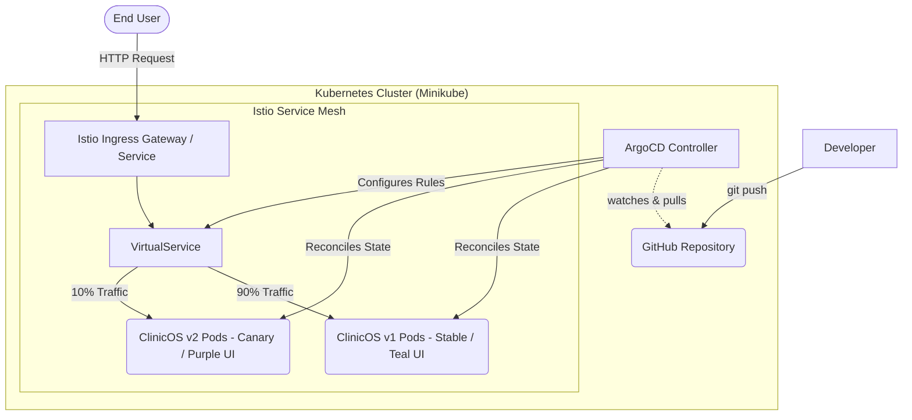

# 🚀 Enterprise GitOps & Service Mesh Platform

<div align="center">
  <h3>Automated GitOps Release Platform with Istio Canary Routing</h3>
  <p><strong>Domain:</strong> Site Reliability Engineering (SRE), DevOps, Cloud-Native Architecture</p>
  <p><strong>Application:</strong> ClinicOS (Stateless React Dashboard)</p>
</div>

<br />

<div align="center">
  
</div>

---

## 📊 Executive Summary

This project demonstrates a production-grade **Continuous Deployment (CD)** pipeline utilizing **GitOps** principles and a **Service Mesh**. It was engineered to solve the critical business problem of deployment downtime and the high risk associated with "big-bang" software releases.

By integrating **ArgoCD** for declarative infrastructure synchronization and **Istio** for advanced network routing, this architecture allows new software versions to be safely tested in production on a fractional user base (10% Canary) before full promotion. This drastically reduces the blast radius of potential production defects and ensures high availability.

---

## 🏗️ System Architecture & Traffic Flow

The infrastructure operates on a strict pull-based GitOps methodology. This GitHub repository acts as the single source of truth for all application and infrastructure states.


```mermaid
graph TD
    A[Developer] -->|git push| B(GitHub Repository)
    
    subgraph "Kubernetes Cluster (Minikube)"
        C[ArgoCD Controller] -.->|watches & pulls| B
        
        subgraph "Istio Service Mesh"
            D[Istio Ingress Gateway / Service]
            E[VirtualService]
            
            D --> E
            E -->|90% Traffic| F(ClinicOS v1 Pods - Stable / Teal UI)
            E -->|10% Traffic| G(ClinicOS v2 Pods - Canary / Purple UI)
        end
        
        C -->|Reconciles State| F
        C -->|Reconciles State| G
        C -->|Configures Rules| E
    end
    
    User([End User]) -->|HTTP Request| D
```

---

## ⚙️ Technology Stack

| Category | Technology | Purpose & Implementation Details |
| :--- | :--- | :--- |
| **Frontend Application** | React.js (Vite) | Stateless Single Page Application serving as the core business logic (ClinicOS). |
| **Containerization** | Docker | Multi-stage builds utilizing `nginx:alpine` for minimal footprint and low-latency serving. |
| **Orchestration** | Kubernetes | Core infrastructure provisioned via Minikube (`6GB RAM`, `4 CPUs`). |
| **GitOps Controller** | ArgoCD | Automated, pull-based state reconciliation, eliminating manual `kubectl apply` commands. |
| **Traffic Management** | Istio | Service mesh providing telemetry, zero-trust security, and weighted routing (Canary deployments). |

---

## 🚀 How to Implement & Run Locally

This section outlines the steps to replicate and run this GitOps pipeline in your local environment. It serves as a practical guide for implementing these concepts in a day-to-day workflow.

### Prerequisites
- [Docker Desktop](https://www.docker.com/products/docker-desktop) installed and running.
- [Minikube](https://minikube.sigs.k8s.io/docs/start/) installed.
- [kubectl](https://kubernetes.io/docs/tasks/tools/) installed.
- [Istioctl](https://istio.io/latest/docs/setup/install/istioctl/) CLI installed.

### Step 1: Provision the Kubernetes Cluster
Start your Minikube cluster with sufficient resources to handle Istio and ArgoCD.
```bash
minikube start --memory=6144 --cpus=4
```

### Step 2: Install ArgoCD (The GitOps Engine)
Create the namespace and install ArgoCD using server-side apply to bypass CRD size limits.
```bash
kubectl create namespace argocd
kubectl apply -n argocd -f https://raw.githubusercontent.com/argoproj/argo-cd/stable/manifests/install.yaml --server-side --force-conflicts
```

### Step 3: Inject the Istio Service Mesh
Install the Istio control plane and label the default namespace so that Istio automatically injects Envoy sidecar proxies into our application pods.
```bash
istioctl install --set profile=default -y
kubectl label namespace default istio-injection=enabled
```

### Step 4: Deploy the Application via GitOps
In a production scenario, you would configure ArgoCD (via its UI or CLI) to connect to this repository. ArgoCD will automatically read the manifests in the `k8s/app/` directory and deploy:
1. `clinicos-v1` (Stable Version - Teal UI)
2. `clinicos-v2` (Canary Version - Purple UI)
3. The Istio `DestinationRule` and `VirtualService` enforcing the 90/10 traffic split.

*(Note: For immediate local testing without ArgoCD configuration, you can manually apply the manifests: `kubectl apply -f k8s/app/`)*

### Step 5: Verify the Canary Deployment
Once pods are running, set up a port-forward to the Istio Ingress Gateway or the application service:
```bash
kubectl port-forward svc/clinicos-service 8080:80
```
Visit `http://localhost:8080` in your browser. Refreshing the page repeatedly will demonstrate the traffic routing: ~90% of requests will serve the **Teal UI (v1)** and ~10% will serve the **Purple UI (v2)**.

---

## 📂 Repository Structure

```text
gitops-canary-pipeline/
├── docs/                       # Comprehensive documentation (Runbooks, Setup, Errors)
├── frontend/                   # ClinicOS React application source code
│   ├── Dockerfile              # Multi-stage build instructions
│   ├── src/                    # UI Components and application logic
│   └── package.json            # Node.js dependencies
├── k8s/                        # Kubernetes Infrastructure as Code (IaC)
│   └── app/                    
│       ├── deployment-v1.yaml  # Stable Release Manifest
│       ├── deployment-v2.yaml  # Canary Release Manifest
│       ├── destination-rule.yaml # Istio Pod Categorization
│       ├── service.yaml        # Internal Cluster Network Gateway
│       └── virtual-service.yaml  # Istio 90/10 Traffic Split Logic
└── README.md                   # You are here
```

---

## 📚 Further Reading

To dive deeper into the engineering decisions, conflict resolutions, and business value of this platform, please refer to the `docs/` directory:
- [The SRE Journey](docs/THE_SRE_JOURNEY.md) - The engineering journal detailing the build process.
- [Architecture Runbook](docs/CMS_PROJECT_BLUEPRINT.DOCX) - Deep dive into declarative infrastructure.
- [Error Ledger](docs/Error_Ledger.md) - Post-mortems on K8s conflicts and solutions.

---
<div align="center">
  <i>Architected and maintained to enterprise Site Reliability Engineering standards.</i>
</div>