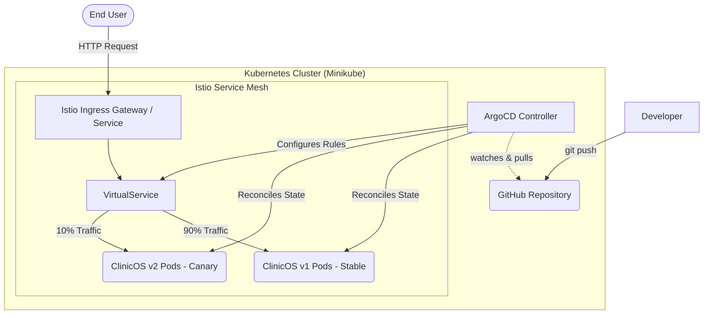

# 🚀 Enterprise GitOps & Service Mesh Platform

**Project:** Automated GitOps Release Platform with Istio Canary Routing  
**Domain:** Site Reliability Engineering (SRE), DevOps, Cloud-Native Architecture  
**Application:** ClinicOS (Stateless React Dashboard)  

## 📊 Executive Summary

This project demonstrates a production-grade Continuous Deployment (CD) pipeline utilizing **GitOps** principles and a **Service Mesh**. It solves the critical business problem of deployment downtime and the high risk associated with "big-bang" software releases. 

By integrating **ArgoCD** for declarative infrastructure synchronization and **Istio** for advanced network routing, this architecture allows new software versions to be safely tested in production on a fractional user base (10% Canary) before full promotion.

## 🏗️ System Architecture & Traffic Flow

The infrastructure operates on a strict pull-based GitOps methodology. The GitHub repository is the single source of truth for all application and infrastructure states.


```mermaid
graph TD
    A[Developer] -->|git push| B(GitHub Repository)
    
    subgraph "Kubernetes Cluster (Minikube)"
        C[ArgoCD Controller] -.->|watches & pulls| B
        
        subgraph "Istio Service Mesh"
            D[Istio Ingress Gateway / Service]
            E[VirtualService]
            
            D --> E
            E -->|90% Traffic| F(ClinicOS v1 Pods - Stable)
            E -->|10% Traffic| G(ClinicOS v2 Pods - Canary)
        end
        
        C -->|Reconciles State| F
        C -->|Reconciles State| G
        C -->|Configures Rules| E
    end
    
    User([End User]) -->|HTTP Request| D

```

## ⚙️ Technology Stack

| Domain | Technology | Implementation Details |
| --- | --- | --- |
| **Application** | React.js (Vite) | Stateless Single Page Application (ClinicOS). |
| **Containerization** | Docker | Multi-stage builds utilizing `nginx:alpine` for low-latency serving. |
| **Orchestration** | Kubernetes | Provisioned via Minikube (`6GB RAM`, `4 CPUs`). |
| **GitOps Controller** | ArgoCD | Automated, pull-based state reconciliation. |
| **Traffic Management** | Istio | Service mesh for telemetry, security, and weighted routing. |

## 📂 Repository Structure

```text
CMS/
├── docs/                       # Project Documentation
│   ├── Error_Ledger.md         # Infrastructure conflict resolution logs
│   └── ARCHITECTURE_RUNBOOK.md # Detailed execution steps
├── frontend/                   # ClinicOS React application source code
│   ├── Dockerfile              # Multi-stage build instructions
│   ├── package.json            # Node dependencies
│   └── src/                    # React components
├── k8s/                        # Kubernetes Infrastructure as Code (IaC)
│   └── app/                    
│       ├── deployment-v1.yaml  # Stable Release Manifest
│       ├── deployment-v2.yaml  # Canary Release Manifest
│       ├── service.yaml        # Internal Cluster Network Gateway
│       ├── destination-rule.yaml # Istio Pod Categorization
│       └── virtual-service.yaml  # Istio 90/10 Traffic Split Logic
├── .gitignore                  
└── README.md                   # Master Documentation

```

## 🚀 Engineering Runbook (Execution Steps)

### Phase 1: Application Containerization (Completed)

* Developed `ClinicOS`, a dynamic medical dashboard.
* Engineered a highly optimized, multi-stage `Dockerfile`.
* Packaged two distinct release candidates:
* **v1 (Stable):** Primary teal user interface.
* **v2 (Canary):** Secondary purple user interface for A/B testing.


* Images pushed to Docker Hub global registry.

### Phase 2: Kubernetes & GitOps Initialization

1. **Provision Infrastructure:**

```bash
minikube start --memory=6144 --cpus=4

```

2. **Install ArgoCD (Server-Side Apply to bypass CRD limits):**

```bash
kubectl create namespace argocd
kubectl apply -n argocd -f [https://raw.githubusercontent.com/argoproj/argo-cd/stable/manifests/install.yaml](https://raw.githubusercontent.com/argoproj/argo-cd/stable/manifests/install.yaml) --server-side --force-conflicts

```

### Phase 3: Service Mesh Injection

1. **Install Istio Control Plane:**

```bash
istioctl install --set profile=default -y

```

2. **Enable Proxy Injection & Restart Pods:**

```bash
kubectl label namespace default istio-injection=enabled
kubectl rollout restart deployment clinicos-v1 clinicos-v2

```

### Phase 4: Canary Deployment & Verification

1. **Apply GitOps Manifests:** Let ArgoCD sync the `k8s/app/` directory.
2. **Verify Traffic Split:** Access the application via a local port-forward. Refreshing the application will yield the `v1` interface 90% of the time, and the `v2` (purple) interface 10% of the time, validating the zero-downtime routing protocol.

## 🛠️ Error Ledger & Troubleshooting

View the [Error Ledger](https://github.com/Indra1806/gitops-canary-pipeline/blob/main/docs/Error_Ledger.md) for detailed post-mortems on Kubernetes field ownership conflicts and infrastructure binary exclusion.

*Architected and maintained to enterprise SRE standards.*
